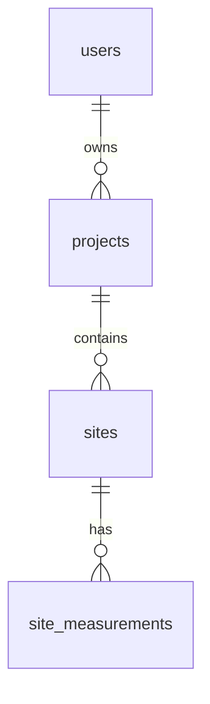

# Step 2: PostgreSQL and PostGIS

The PDF requires PostgreSQL with PostGIS. Psycopg is the Python driver connecting
FastAPI to PostgreSQL, and python-dotenv reads the local configuration file.
These support the required database stack. Database tables are defined in SQL
so their relationships and spatial constraints are directly visible.

## This workspace

The existing PostgreSQL service requires a password that was unavailable during
setup. A separate local instance was therefore created for this project:

| Setting | Value |
| --- | --- |
| Host | `127.0.0.1` |
| Port | `5433` |
| Database | `darukaa_earth` |
| Local database role | `darukaa_local` |
| Password | Generated and saved in `Backend/.env` |
| PostgreSQL | 18.6, copied from the installed PostgreSQL 18 binaries |
| PostGIS | 3.6.2, from the official OSGeo Windows bundle |
| Program files | `.local/postgresql/` |
| Database data | `.local/postgres-data/` |
| Server log | `.local/postgres.log` |

This instance uses password authentication and listens only on `127.0.0.1`.
The original PostgreSQL installation, service, password, and databases were not
changed. `.local/` and `.env` are excluded from Git. The local role is a bootstrap
administrator; deployment will use credentials configured for the hosted database.

Run these commands from the project root:

```powershell
# Start the database, or report that it is already running.
.\scripts\local_database.ps1 start

# Check its process status.
.\scripts\local_database.ps1 status

# Stop the project database when finished.
.\scripts\local_database.ps1 stop
```

Start it again after a computer restart. A normal stop/start retains the data.
This local helper is not a Windows service. If running from a restricted agent
sandbox produces `could not create restricted token`, use a normal PowerShell
terminal or approve the narrowly scoped database start command.

## Create or verify the schema

From the project root:

```powershell
Set-Location Backend
.\venv\Scripts\python.exe -m app.init_db --create-database
```

The `--create-database` option creates the configured database only if it is
missing. It requires a PostgreSQL role with `CREATEDB`. On later runs, this is
enough:

```powershell
.\venv\Scripts\python.exe -m app.init_db
```

Expected output for the initialized local database:

```text
Applied: already up to date
Database ready: darukaa_earth | PostGIS 3.6.2
Tables: users, projects, sites, site_measurements
```

Initialization is a CLI step. It does not run automatically on an API request
or rebuild tables when FastAPI reloads. API routes using the database will use
the `get_db` dependency: successful work commits, exceptions roll back, and the
connection closes after each request.

## Tables and relationships



| Table | Columns and rules |
| --- | --- |
| `users` | UUID `id`, `full_name`, `email`, `password_hash`, `created_at`. Email uniqueness ignores case. Registration validates email addresses and stores Argon2 password hashes. |
| `projects` | UUID `id`, `owner_id` referencing users, `name`, `description`, `created_at`. Owner ID is indexed. |
| `sites` | UUID `id`, `project_id`, `name`, `boundary`, `created_at`. Project ID and spatial boundary are indexed. |
| `site_measurements` | Identity `id`, `site_id`, `recorded_on`, `carbon_tonnes_co2e`, `biodiversity_score`, `is_mock`, `created_at`. Unique `(site_id, recorded_on)` also indexes time-series lookups. |

Deleting a parent cascades to its children. The schema makes ownership
queryable; JWT authentication is implemented in step 3, and project/site routes
check the signed-in user's ownership in step 4. Foreign keys alone do not
authorize a user's request. The API takes the owner ID from the verified JWT
and joins sites to their parent project for ownership checks.

Sites use `geometry(POLYGON, 4326)`: two-dimensional longitude/latitude coordinates.
Constraints require a valid, non-empty polygon, with longitude between -180 and
180 and latitude between -90 and 90. GeoJSON uses `[longitude, latitude]` order.
The spatial index uses GiST.

The PDF asks for carbon/biodiversity analytics over time but does not specify
metrics. Our illustrative fields are nonnegative tonnes of CO2 equivalent and
a biodiversity score from 0 to 100. These are placeholders for documented demo
data, not a scientific measurement methodology. `is_mock` defaults to true.
No shared mock account, project, site, or measurement is inserted by a database
migration. Instead, an authenticated user can request their own isolated,
idempotent demo workspace through `POST /projects/demo`; see
[ANALYTICS.md](ANALYTICS.md).

## Migrations and verification

`Backend/migrations/001_initial_schema.sql` enables PostGIS and creates the four
application tables. `schema_migrations` is an additional internal bookkeeping
table. The runner records each file's checksum, detects changes to applied
migrations, and applies pending files in a transaction under a migration lock.
Future schema changes belong in a new numbered migration.

Run from `Backend` while PostgreSQL is running:

```powershell
.\venv\Scripts\python.exe -m unittest discover -s tests -v
```

There are 5 configuration tests and 11 integration tests. They verify environment
settings, literal password handling, GeoJSON round trips, polygon validation,
case-insensitive email uniqueness, foreign keys, metric limits, duplicate dates,
cascading relationships, migration repeatability, and failed-migration rollback.
Integration tests use a temporary schema inside a transaction for each test and
roll back afterward; they do not delete existing application records. The test
role needs permission to create schemas. Missing database access is reported as
a failure, not a successful skipped integration check.

## Fresh-clone setup with an existing PostgreSQL server

1. Install PostgreSQL and its matching PostGIS package. For Windows, the
   [official PostGIS installation guide](https://postgis.net/documentation/getting_started/install_windows/released_versions/)
   describes StackBuilder and the OSGeo ZIP packages.
2. Create the Python virtual environment and install `Backend/requirements.txt`
   as described in the main README.
3. Copy `Backend/.env.example` to `Backend/.env`, then set your host, port,
   database name, database user, and password. The example uses port 5432 for
   a normal PostgreSQL installation. Put passwords containing spaces or `#`
   inside single quotes. Environment variables override the file.
4. Run `python -m app.init_db --create-database` from `Backend` in the virtual
   environment. The role needs permission to create the database and enable
   PostGIS. If the database already exists, omit `--create-database`. If the
   hosting provider manages extensions, enable PostGIS through that provider
   before running migrations with the application database owner.
5. Run the tests and then start FastAPI using the main README's command.

The local `.env` is deliberately not distributed with the repository. Use
`DB_SSLMODE=require` or certificate verification as required by the hosting
provider when configuring a remote database.

## Reproduce the separate Windows instance

For a fresh workspace with PostgreSQL 18 binaries available and no configured
database credentials, download the released PostGIS bundle to the project:

```powershell
New-Item -ItemType Directory -Path .local/downloads -Force
Invoke-WebRequest -Uri https://download.osgeo.org/postgis/windows/pg18/postgis-bundle-pg18-3.6.2x64.zip -OutFile .local/downloads/postgis-bundle-pg18-3.6.2x64.zip
.\Backend\venv\Scripts\python.exe scripts/setup_local_database.py
```

The [official release page](https://postgis.net/documentation/getting_started/install_windows/released_versions/)
links to this OSGeo bundle. Setup copies only program/library/share directories
from the installed PostgreSQL and adds the PostGIS bundle to that local copy.
It initializes fresh data, generates credentials, and starts on port 5433.
Only the `postgis` extension is enabled by our migration.

Use `--postgres-root` if PostgreSQL 18 is installed elsewhere, or `--port` if
5433 is occupied. The script preserves an existing initialized local cluster
or a populated `.env` instead of replacing its credentials. Finally, run the
schema initialization command above.
